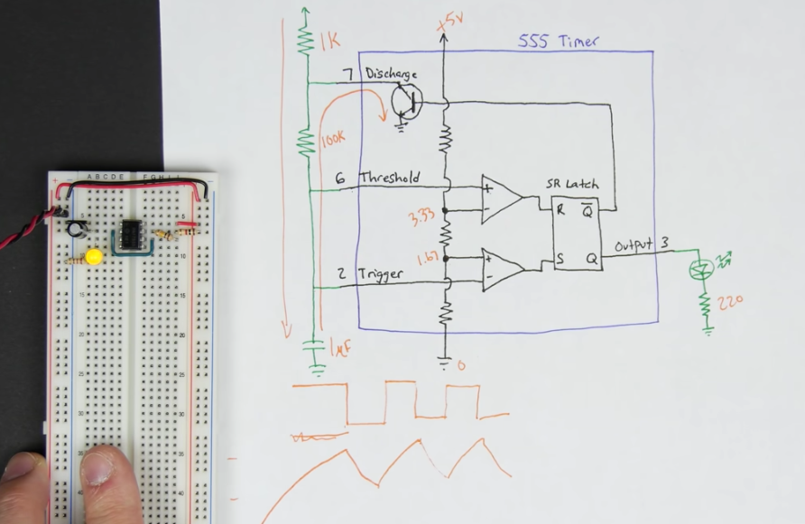

## Overview
A computer's clock is like the heart of the computer that drives the work the processor should do. With each tick of the clock, the processor performs some action - maybe it's to fetch an instruction from memory or perform a mathematical operation.  

Generally speaking, a computer's clock is a square wave of pulses, the frequency of which determines how fast your processor can perform operations. Obviously, if on each pulse the processor does some work (executes operations), then the faster the pulses (frequency) the faster you can perform operations. Unfortunately it's not possible to just wind the frequency up. The faster the frequency the more the imperfections of the real world start to matter. This is analanalogous to a car; the faster you drive, the more drag matters.. the faster you want the engine to spin, the finer the engineering needs to be. At it's core a Formula 1 car is identical to your road-car, but the engineering and tolerances are much more fine tuned. 

The clock module aims to produce a stable square wave. As the logic families in use in this design are classic TTL variants, we require the clock to fluctuate from 0v/5v (as these are when TTL recognises a logic 0 and logic 1). It is desirable that the clock switch from off->on, and on->off as quickly as possible, and to be clearly on or off, we don't want a clock signal that is wobbling around all over the place and making it hard to tell if it's on or off. Lastly, we are also aiming to keep a 50% duty cycle - that is, the square wave should be on for half the time and off for half the time. One complete on/off pulse is referred to as the Period (measured in seconds); the number of pulses per second is referred to as the frequency, measured in Hz.

The clock module is built around one of the most famous, and most versatile integrated circuts of all time, the 555 timer. 

_Reference Material is listed in each section_

## Pre-Requisite Knowledge
- SR Latch
  - [Ben Eater: SR Latch](https://www.youtube.com/watch?v=KM0DdEaY5sY)
- 555 Timers 

## Part 1: Basic 555 Circuit (Astable Timer)
### Video Lesson
- [Astable 555 timer - 8-bit computer clock - part 1](https://youtu.be/kRlSFm519Bo)
### Theory of Operation & Notes
#### Inside the 555 (2:47)

- _internal resistors are 3x 5K resistors which form a voltage divider_
### Build & Test
#### Power Supply & Voltage Rails
#### Basic 555 Circuit
#### Improving Performance
##### Decoupling Capacitors
##### Overshooting on Rising Edge
##### Reset Protection
#### Variable Frequency Clock
### Final Schematic, Fritzing and Breadboard

## Part 2: Basic 555 Circuit (Monostable Timer)

## Part 3: Basic 555 Circuit (Bistable Timer)

## Part 4: Clock Module

## Reference Material 
1. 555 Datasheet  